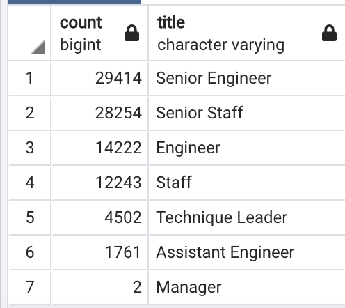

# Pewlett-Hackard-Analysis

## Overview of Analysis
The purpose of this analysis is to determine the number of retiring employees per title, and identify which employees are eligible to participate in a mentorship program. 

## Results
 - As seen in the screenshot below, majority of retirees (~64%) have the title "Senior Engineer". 
 - Second highest count for retiree titles is "Senior Staff". 
  - There are 90,398 employees in the pool of employees getting ready to retire. 
 
  
 
 - For the mentorship program, majority of employees have "Senior" in their title. 
 - There are 1,550 employees that are eligible to be a part of the mentorship program. 
 
## Summary
- How many roles will need to be filled as the "silver tsunami" begins to make an impact?
  - Considering there are a total of 90,398 employees retirement ready, they will need to fill that many roles. 
- Are there enough qualified, retirement-ready employees in the departments to mentor the next generation of Pewlett Hackard employees?
  - There are 1,550 employees that are in the mentorship program. This is not enough of the retirement pool of employees to mentor the next generation. 
- There should be more analysis done with these employees to determine if the current employees have the skills to mentor the new ones considering technologies and times have changed in the workforce. 

